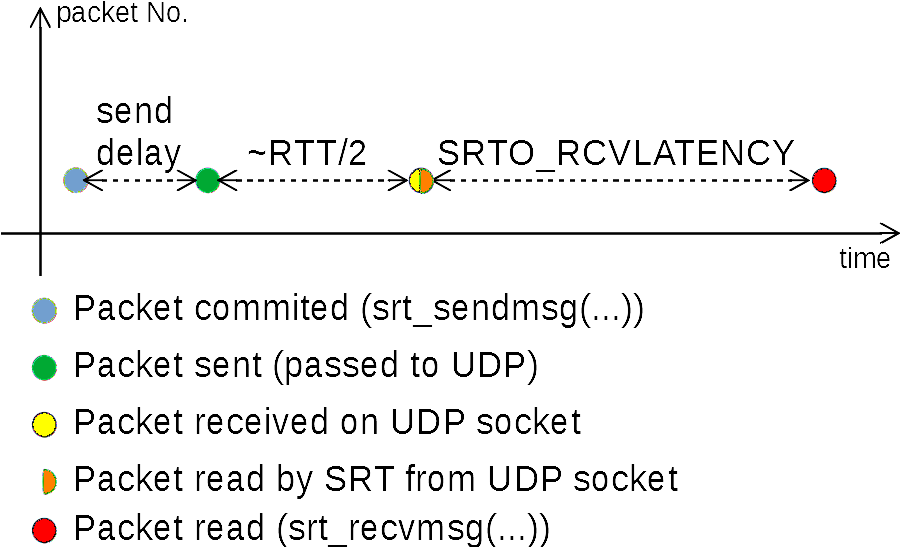

# SRT Latency

SRT has an end-to-end latency between the time a packet is given to SRT with `srt_sendmsg(...)` and the time this very packet is received from SRT via `srt_recvmsg(...)`.

The timing diagram illustrates those key latency points with TSBPD enabled (live mode).



!!! Note "End-to-end latency"

    The actual latency on the link will roughly be SRTO_RCVLATENCY + 1/2 × RTT<sub>0</sub>, where RTT<sub>0</sub> is the RTT value during the handshake.

## Packet Delivery Time

Packet delivery time is the time point, estimated by the receiver, when a packet should be given (delivered) to the upstream application (via `srt_recvmsg(...)`).
It consists of the `TsbPdTimeBase` - the base time difference between sender's and receiver's clock, receiver's buffer delay `TsbPdDelay`, a timestamp of a data packet `PKT_TIMESTAMP`,
and a time drift `Drift`.

`PktTsbPdTime = TsbPdTimeBase + TsbPdDelay + PKT_TIMESTAMP + Drift`

## TSBPD Base Time

`TsbPdTimeBase` is the base time difference between local clock of the receiver, and the clock used by the sender to timestamp packets being sent. A unit of measurement is microseconds.

### Initial value

The value of `TsbPdTimeBase`  is initialized at the time of the handshake request \(`HSREQ` \) is received.  
`TsbPdTimeBase = T_NOW - HSREQ_TIMESTAMP`.  
This value should roughly correspond to the one-way delay \(**~RTT/2**\).

### TSBPD Wrapping Period

The value of  `TsbPdTimeBase`  can be updated during the **TSBPD** wrapping period. The period starts **30 seconds before** reaching the maximum timestamp value of a packet \(`CPacket::MAX_TIMESTAMP`\), and ends whens the timestamp of the received packet is within \[30; 60\] seconds.  
`CPacket::MAX_TIMESTAMP = 0xFFFFFFFF`, or maximum 32-bit unsigned integer value. The value is in microseconds, which corresponds to 1 hour 11 minutes and 35 seconds \(01:11:35\).  
In other words, TSBPD time wrapping happens every 01:11:35.

During this wrapping period, a packet may have a timestamp close to `CPacket::MAX_TIMESTAMP`, as well as close to `0`. Both cases are handled. In the first case, the current value of `TsbPdTimeBase` is used. In the seconds case, `TsbPdTimeBase + CPacket::MAX_TIMESTAMP + 1` is used to calculate TSBPD time of a packet.

The wrapping period ends when the timestamp of the received packet is within the interval \[30; 60\] seconds. The updated value will be `TsbPdTimeBase += CPacket::MAX_TIMESTAMP + 1`.

### Time Drift

The value of  `TsbPdTimeBase`  can be updated by the DriftTracer.

## Time Drift Sample

Upon receipt of an `ACKACK` packet, the timestamp of this control packet is used as a sample for drift tracing. `ACKACK` timestamp is expected to be half the round-trip time ago \(**RTT/2**\). The drift time **DRIFT** is calculated from the current time **T\_NOW**; the TSBPD base time `TsbPdTimeBase`; and the timestamp **ACKACK\_TIMESTAMP** of the received `ACKACK` packet.

`DRIFT = T_NOW - (TsbPdTimeBase + ACKACK_TIMESTAMP)`

The base time should stay in sync with `T_NOW - T_SENDER` , and should roughly correspond to **~RTT/2**. The value of `ACKACK_TIMESTAMP` should represent `T_SENDER`, and be **~RTT/2** in the past.  
Therefore, the above equation can be considered as   
`DRIFT = T_NOW - (T_NOW - T_SENDER + T_SENDER) -> 0` if the link latency remains constant.

Assuming that the link latency is constant \(RTT=const\), the only cause of the drift fluctuations should be clock inaccuracy.

!!! Error "Drift Tracer should consider RTT"

    Time drift sample does not take RTT fluctuations into account.
    Instead an increase of RTT will be treated as a time drift. See [issue 753](https://github.com/Haivision/srt/issues/753).

## Drift Tracing and Adjustment

Drift tracing is based on accumulating the sum of drift samples.  
**DriftSum** - the sum of the time drift samples on a **MAX\_SPAN** number of samples.  
**DriftSpan** is the current number of accumulated samples.  
The default value of **MAX\_SPAN** is 1000 samples.  
The default value of **MAX\_DRIFT** is 5000 μs \(5 ms\).  
The default value of **CLEAR\_ON\_UPDATE** is **true**.

On each **DriftSpan** sample, the average drift value **Drift** is updated as  
`Drift = DriftSum / DriftSpan`.  
The values of **DriftSpan** and **DriftSum** are reset to 0.

If the absolute value of the Drift exceeds **MAX\_DRIFT** \(`|Drift| > MAX_DRIFT`\), the remainder goes to **OverDrift** value.  
The value of **OverDrift** is used to update the **TsbPdTimeBase**.

In pseudo-code it looks like this:

```text
bool update(int64_t driftval)
{
	DriftSum += driftval;
	++DriftSpan;

	if (m_uDriftSpan < MAX_SPAN)
		return false;

	if (CLEAR_ON_UPDATE)
		Overdrift = 0;

	Drift     = DriftSum / DriftSpan;
	DriftSum  = 0;
	DriftSpan = 0;

	if (std::abs(Drift) > MAX_DRIFT)
	{
		Overdrift = Drift < 0 ? -MAX_DRIFT : MAX_DRIFT;
		Drift    -= Overdrift;
	}

	// Drift value was updated
	return true;
}
```

!!! TODO "Consider RTTVar before changin the Drift value"

    **RTTVar** expresses the variation of RTT values over time. Those variations should be considered when Drift is updated.
	

## Class DriftTracer

The **DriftTracer** class has the following prototype.

```text
template<unsigned MAX_SPAN, int MAX_DRIFT, bool CLEAR_ON_UPDATE = true>
class DriftTracer
{
public:
    DriftTracer();
public:
    bool update(int64_t driftval);
    int64_t drift() const;
    int64_t overdrift() const;
};
```